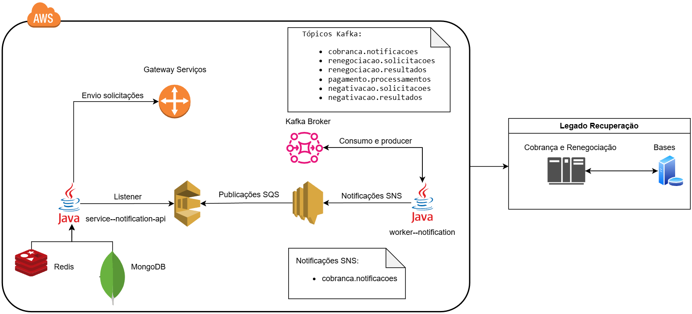

# Case-Reneg - Modernização do Sistema de Cobrança e Renegociação



## 📌 Descrição
Este projeto visa modernizar o legado dos sistemas de recuperação de crédito, incluindo cobrança e renegociação. A solução busca desacoplar funcionalidades de um sistema monolítico baseado em mainframe para uma arquitetura moderna baseada em microserviços, utilizando tecnologias emergentes como **AWS, Kafka, SQS, SNS, Redis e MongoDB**.

## 🏗 Arquitetura
A arquitetura proposta adota uma abordagem baseada em **eventos**, utilizando **Apache Kafka** para consumo e publicação de mensagens. Os principais componentes incluem:

- **Gateway de Serviços**: Recebe solicitações externas.
- **Kafka Broker**: Utilizado para troca de mensagens entre os serviços.
- **Service Notification API (Java)**: Processa notificações e interage com **Redis e MongoDB**.
- **SQS & SNS (AWS)**: Utilizados para filas e notificações.
- **Worker Notification (Java)**: Processa eventos e interage com sistemas legados.
- **Legado Recuperação**: Sistema monolítico que será modernizado gradualmente.

### 🔹 Tecnologias Utilizadas
- **Java (Spring Boot)**
- **Apache Kafka**
- **AWS (SQS, SNS, Lambda)**
- **MongoDB**
- **Redis**
- **Docker & Kubernetes**

## 📜 Requisitos Funcionais
- 📩 **Ações de Cobrança**: Envio de notificações via SMS, e-mail e carta.
- 🔒 **Negativação**: Integração com birôs de crédito (Serasa, SPC, etc.).
- 🔄 **Renegociação**: Simulação de pagamentos, agrupamento de dívidas e efetivação de acordos.
- 💳 **Pagamentos**: Emissão e processamento de boletos e débitos em conta.

## 🚀 Como Executar o Projeto
1. Clone o repositório:
   ```sh
   git clone https://github.com/LucasPLopes/itau-case-reg.git
   cd case-reneg
